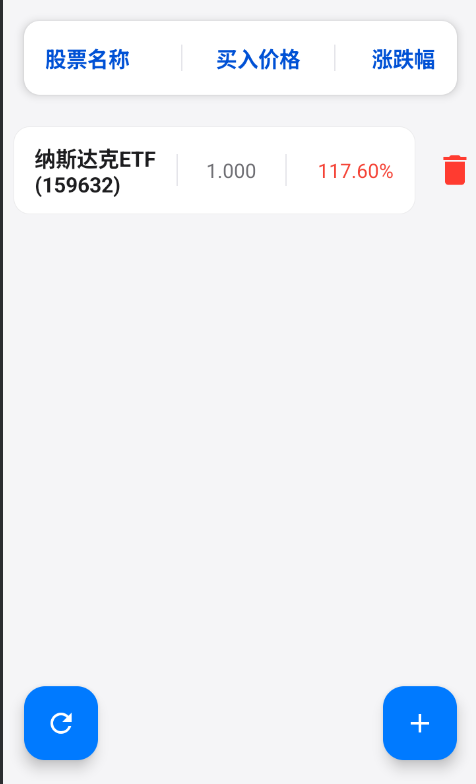
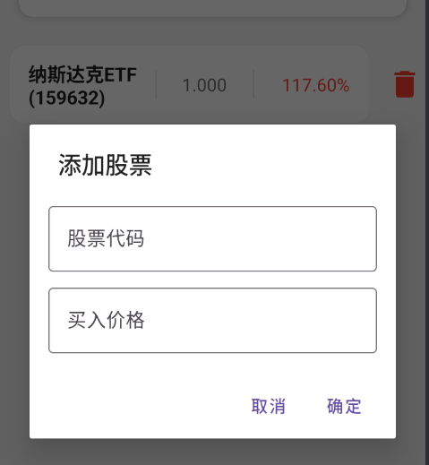
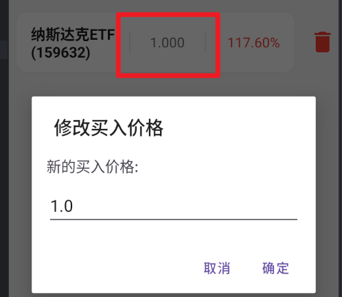

# 📱 项目概述
受到 4%定投法 启发，开发了一个辅助定投的工具
Android辅助定投应用，支持实时获取股票价格、计算涨跌幅，并提供本地数据存储功能。

## 界面

主界面：

添加框：

修改价格：

## ✨ 主要功能

### 📊 股票管理
- **添加股票**：输入股票代码和买入价格
- **删除股票**：长按股票项删除
- **编辑价格**：点击股票价格可项修改买入价格
- **一键刷新**：获取所有股票最新数据，计算涨跌幅

### 💾 数据存储
- 本地JSON文件保存 (`stock_data.json`)
- 应用重启自动加载数据

### 🌐 网络功能
- 东方财富API获取实时数据
- 支持沪深两市股票识别